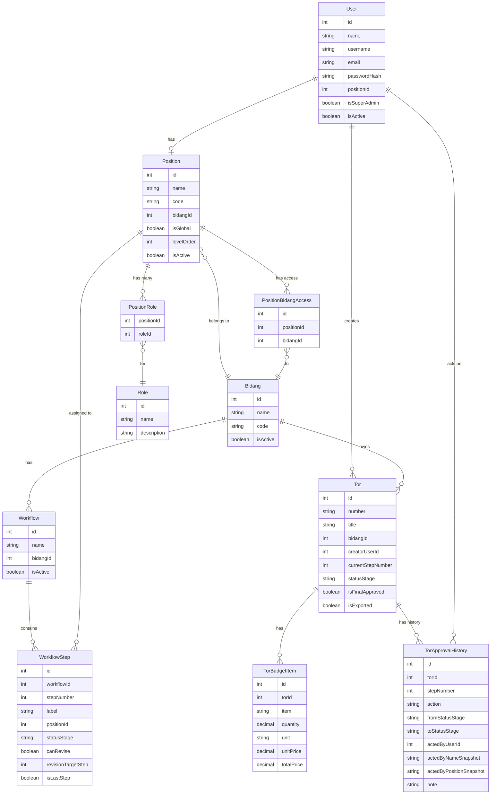
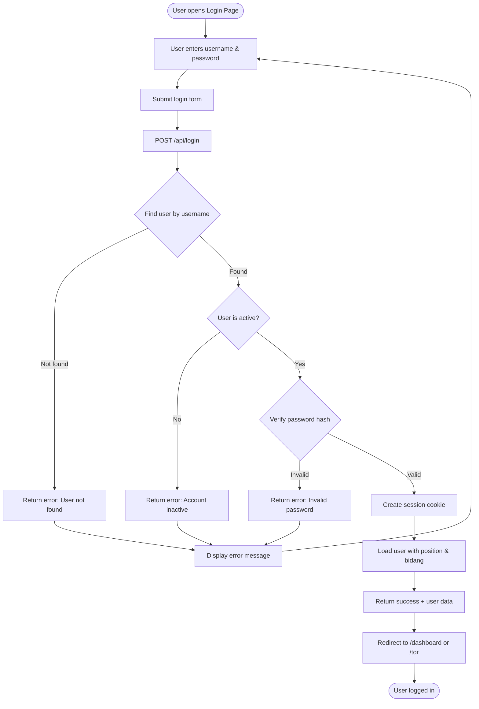
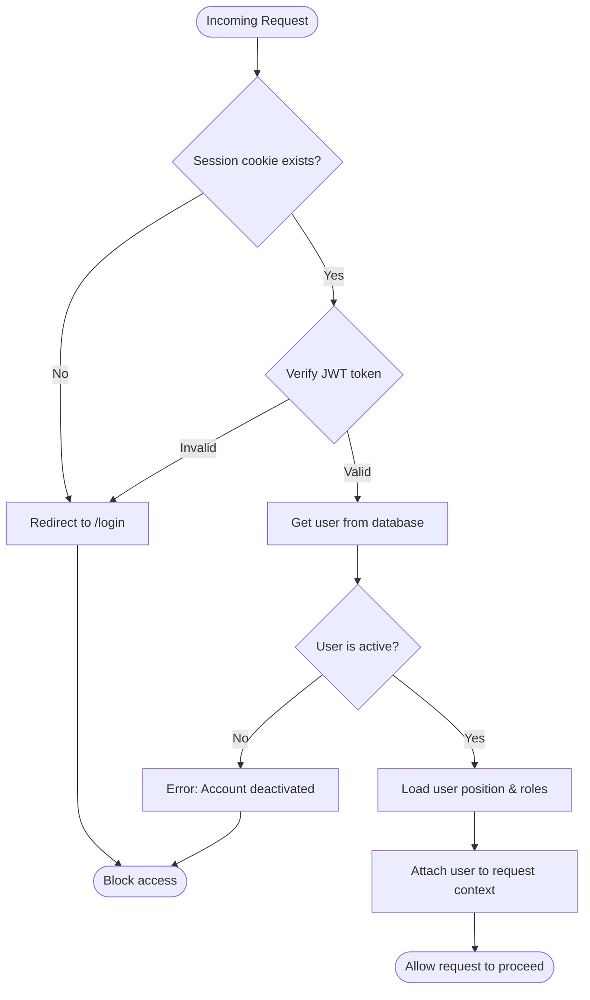
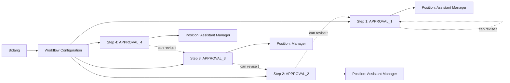
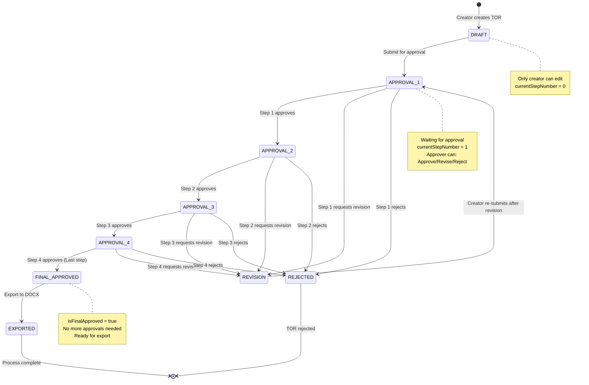
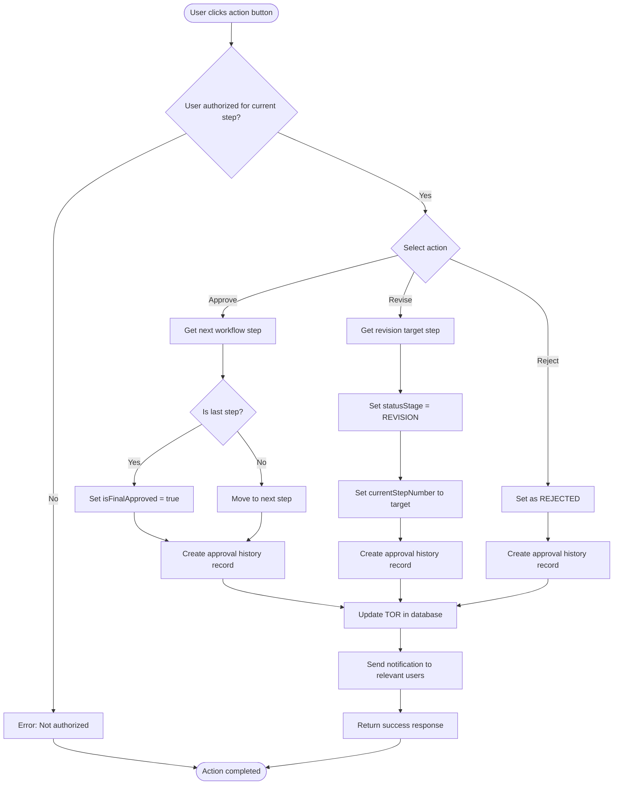
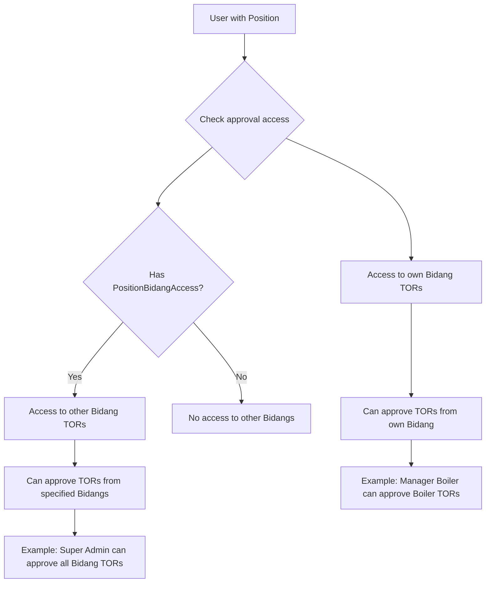
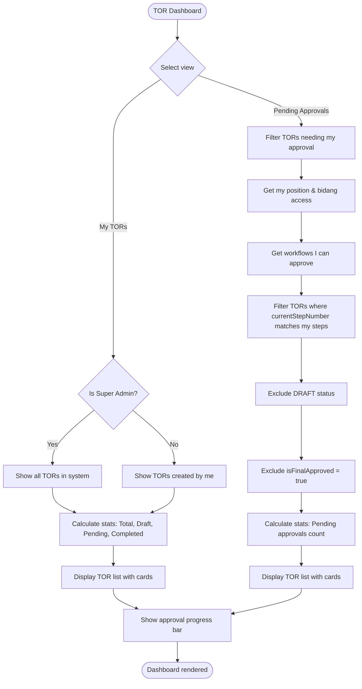
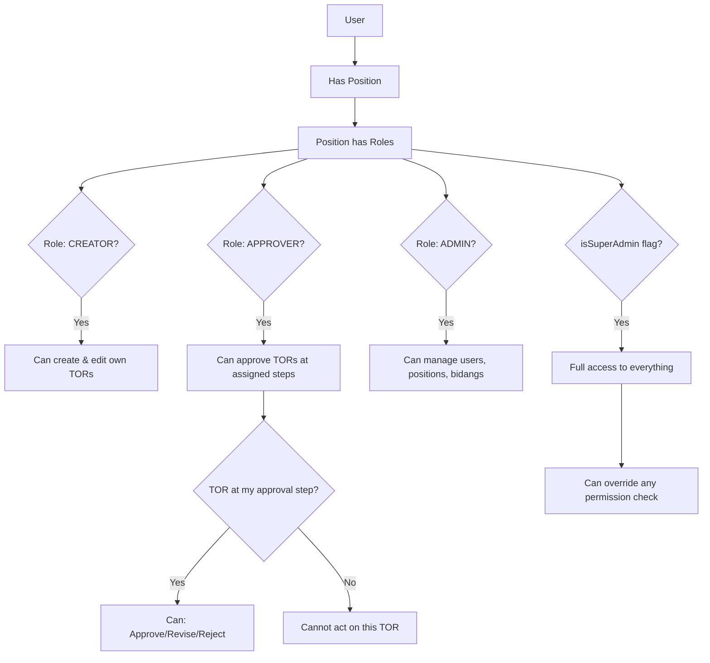

# TOR Online System - Diagrams & Documentation

Dokumentasi lengkap untuk Entity Relationship Diagram (ERD) dan Flow Diagram sistem TOR Online.

---

## 1. Entity Relationship Diagram (ERD)

### Database Schema Overview



---

## 2. Authentication & Authorization Flow

### Login Process



### Authorization Check (Middleware)



---

## 3. TOR Approval Workflow System

### Workflow Configuration per Bidang



### TOR Lifecycle - Complete Flow



### Approval Action Process



### Cross-Bidang Approval Access



---

## 4. TOR Dashboard & Filtering Logic

### Dashboard Views



---

## 5. System Architecture Overview

### Application Layers

```mermaid
graph TB
    subgraph "Presentation Layer"
        UI[Next.js Pages & Components]
        Login[Login Page]
        Dashboard[Dashboard]
        TORForm[TOR Form Tabs]
        Admin[Admin Pages]
    end

    subgraph "API Layer"
        AuthAPI[/api/login, /api/logout]
        ProfileAPI[/api/profile]
        TORAPI[/api/tor/*]
        ApprovalAPI[/api/tor/[id]/approve]
        AdminAPI[/api/admin/*]
    end

    subgraph "Business Logic"
        AuthService[Authentication Service]
        WorkflowEngine[Workflow Approval Engine]
        TORService[TOR CRUD Service]
        ExportService[DOCX Export Service]
    end

    subgraph "Data Layer"
        Prisma[Prisma ORM]
        PostgreSQL[(PostgreSQL Database)]
    end

    UI --> AuthAPI
    UI --> ProfileAPI
    UI --> TORAPI
    UI --> ApprovalAPI
    UI --> AdminAPI

    AuthAPI --> AuthService
    ProfileAPI --> AuthService
    TORAPI --> TORService
    ApprovalAPI --> WorkflowEngine
    AdminAPI --> TORService

    AuthService --> Prisma
    WorkflowEngine --> Prisma
    TORService --> Prisma
    ExportService --> Prisma

    Prisma --> PostgreSQL
```

---

## 6. Key Enums & Status Definitions

### TorStatusStage

| Status       | Description                  | Who Can Edit       |
| ------------ | ---------------------------- | ------------------ |
| `DRAFT`      | Initial state, not submitted | Creator only       |
| `APPROVAL_1` | Waiting for step 1 approval  | Approver at step 1 |
| `APPROVAL_2` | Waiting for step 2 approval  | Approver at step 2 |
| `APPROVAL_3` | Waiting for step 3 approval  | Approver at step 3 |
| `APPROVAL_4` | Waiting for step 4 approval  | Approver at step 4 |
| `REVISION`   | Sent back for revision       | Creator only       |

### TorActionType

| Action    | Description               | Effect                                         |
| --------- | ------------------------- | ---------------------------------------------- |
| `SUBMIT`  | Submit draft for approval | Changes status from DRAFT to APPROVAL_1        |
| `APPROVE` | Approve current step      | Moves to next step or sets final approval      |
| `REVISE`  | Request revision          | Sets status to REVISION, resets to target step |
| `REJECT`  | Reject TOR completely     | TOR cannot proceed further                     |
| `EXPORT`  | Export to DOCX            | Generates Word document                        |

---

## 7. Security & Permissions

### Role-Based Access Control



---

## Summary

Sistem TOR Online adalah aplikasi manajemen dokumen Terms of Reference dengan fitur:

1. **Authentication**: Login berbasis username/password dengan session management
2. **Multi-level Approval**: Workflow approval hingga 4 tingkat per bidang
3. **Cross-Bidang Access**: Position dapat meng-approve TOR dari bidang lain
4. **Dynamic Workflow**: Setiap bidang memiliki konfigurasi approval sendiri
5. **Audit Trail**: Semua aksi tercatat di TorApprovalHistory
6. **RBAC**: Role-based access control dengan Position dan Role
7. **Export**: Generate DOCX dengan semua data TOR

Database menggunakan PostgreSQL dengan Prisma ORM, dan seluruh sistem berjalan di Next.js 15 dengan App Router.
